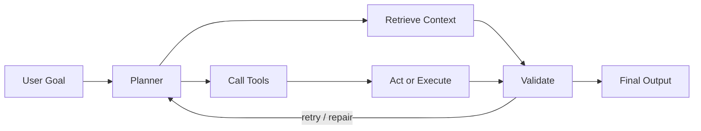

  <strong>AI Software Engineer building reliable systems around LLMs, retrieval, agents, tools, evaluation, and scalable infrastructure.</strong>

  
  
  

  
  
  
  
  

---

## What I Build

I build AI systems around LLMs, retrieval, agents, tools, and reliability. I care about the engineering around the model: clean APIs, measurable retrieval, eval loops, latency, observability, and recovery from real failure modes.

<table>
  <tr>
    <td width="25%" align="center"><strong>Plan</strong> decompose goals into reliable steps</td>
    <td width="25%" align="center"><strong>Retrieve</strong> measure context quality and citations</td>
    <td width="25%" align="center"><strong>Act</strong> call tools with state and guardrails</td>
    <td width="25%" align="center"><strong>Validate</strong> score outputs, trace failures, repair</td>
  </tr>
</table>

---

## Featured Builds

<table>
  <tr>
    <td width="50%" valign="top">
      <h3><a href="https://github.com/harihkk/surf-agentic-browser">Surf</a></h3>
      
<strong>Autonomous browser agent</strong> that turns natural-language goals into Playwright actions.

      
<strong>Hard parts:</strong> browser state, tool calls, bad actions, loops, provider fallback.

      
<code>FastAPI</code> <code>Playwright</code> <code>WebSockets</code> <code>Groq</code> <code>Gemini</code> <code>Ollama</code>

    </td>
    <td width="50%" valign="top">
      <h3>AskRC</h3>
      
<strong>Production-style RAG platform</strong> for technical documentation and research workflows.

      
<strong>Hard parts:</strong> ingestion, retrieval quality, citation validation, answer checks.

      
<code>LangChain</code> <code>vector databases</code> <code>MLflow</code> <code>DVC</code> <code>Azure Search</code>

    </td>
  </tr>
  <tr>
    <td width="50%" valign="top">
      <h3>Prompt-Budd</h3>
      
<strong>Prompt optimization system</strong> with scoring, rewriting, PII detection, and MCP support.

      
<strong>Hard parts:</strong> real-time UX, safe rewriting, prompt quality feedback.

      
<code>Chrome Extension</code> <code>FastAPI</code> <code>MCP</code> <code>Gemini</code> <code>OpenAI</code>

    </td>
    <td width="50%" valign="top">
      <h3>GenBI</h3>
      
<strong>Natural-language BI assistant</strong> that turns datasets into charts, tables, and answers.

      
<strong>Hard parts:</strong> routing analytical questions into reliable visual/data outputs.

      
<code>Python</code> <code>FastAPI</code> <code>LangChain</code> <code>Plotly</code> <code>Pandas</code>

    </td>
  </tr>
</table>

---

## System Design Lens

---

## Current Focus

<table>
  <tr>
    <td width="50%"><strong>Browser-agent reliability</strong> state, action quality, loops, tool recovery</td>
    <td width="50%"><strong>RAG answer validation</strong> retrieval measurement, citations, answer checks</td>
  </tr>
  <tr>
    <td width="50%"><strong>Eval traces for agents</strong> step-level scoring, failure analysis, repair loops</td>
    <td width="50%"><strong>Production-style case studies</strong> clean architecture, observability, deployable systems</td>
  </tr>
</table>

---

## Stack

  

---

## GitHub Signal

 

---

 

