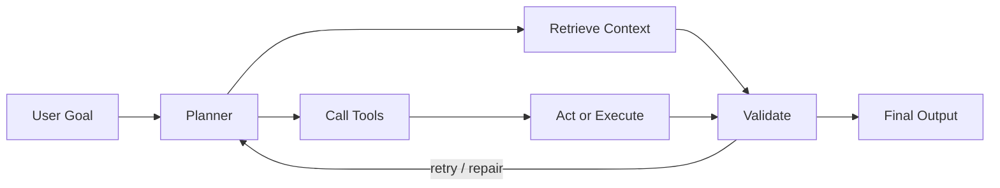

# Hari Kancharla

**AI Software Engineer**

Production-grade LLM systems, agentic workflows, RAG platforms, eval loops, and scalable AI infrastructure.

  
  
  
  

---

## About

I build AI systems around LLMs, retrieval, agents, tools, and reliability. I care about the engineering around the model: clean APIs, measurable retrieval, eval loops, latency, observability, and recovery from real failure modes.

---

## Featured Builds

| Project | What it does | Hard parts | Stack |
|---|---|---|---|
| [**Surf**](https://github.com/harihkk/surf-agentic-browser) | Autonomous browser agent that turns natural-language goals into Playwright actions. | Browser state, tool calls, bad actions, loops, provider fallback. | `FastAPI` `Playwright` `WebSockets` `Groq` `Gemini` `Ollama` |
| **AskRC** | Production-style RAG platform for technical documentation and research workflows. | Ingestion, retrieval quality, citation validation, answer checks. | `LangChain` `vector databases` `MLflow` `DVC` `Azure Search` |
| **Prompt-Budd** | Prompt optimization system with scoring, rewriting, PII detection, and MCP support. | Real-time UX, safe rewriting, prompt quality feedback. | `Chrome Extension` `FastAPI` `MCP` `Gemini` `OpenAI` |
| **GenBI** | Natural-language BI assistant that turns datasets into charts, tables, and answers. | Routing analytical questions into reliable visual/data outputs. | `Python` `FastAPI` `LangChain` `Plotly` `Pandas` |

---

## System Design Lens

---

## Currently Building

| Focus | Why it matters |
|---|---|
| Browser-agent reliability | Better state tracking, action quality, loop prevention, and recovery. |
| RAG answer validation | Measurable retrieval, grounded citations, and answer checks. |
| Eval traces for agent workflows | Step-level scoring, failure analysis, and repair loops. |
| Production-style AI case studies | Clean architecture, observability, and systems that can ship. |

---

## Stack

---

## GitHub Signal

---

**Building AI systems that do more than demo well.**
 
They retrieve context, call tools, handle failure, validate outputs, and ship.

