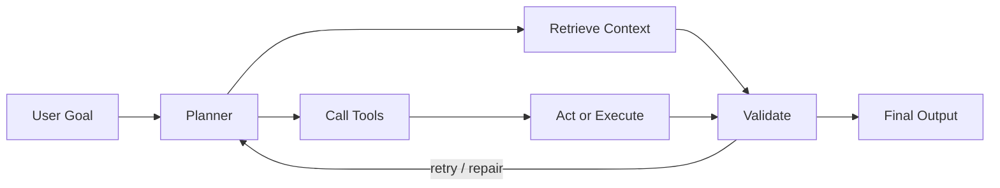

  <strong>AI Software Engineer building production-grade LLM systems, agentic workflows, RAG platforms, eval loops, and scalable AI infrastructure.</strong>

  
  
  

---

## About

I build AI systems around LLMs, retrieval, agents, tools, and reliability. I care about the engineering around the model: clean APIs, measurable retrieval, eval loops, latency, observability, and recovery from real failure modes.

---

## Featured Builds

<table>
  <tr>
    <td width="50%" valign="top">
      <h3><a href="https://github.com/harihkk/surf-agentic-browser">Surf</a></h3>
      
Autonomous browser agent that turns natural-language goals into Playwright actions.

      
<strong>Hard parts:</strong> browser state, tool calls, bad actions, loops, provider fallback.

      
<code>FastAPI</code> <code>Playwright</code> <code>WebSockets</code> <code>Groq</code> <code>Gemini</code> <code>Ollama</code>

    </td>
    <td width="50%" valign="top">
      <h3>AskRC</h3>
      
Production-style RAG platform for technical documentation and research workflows.

      
<strong>Hard parts:</strong> ingestion, retrieval quality, citation validation, answer checks.

      
<code>LangChain</code> <code>vector databases</code> <code>MLflow</code> <code>DVC</code> <code>Azure Search</code>

    </td>
  </tr>
  <tr>
    <td width="50%" valign="top">
      <h3>Prompt-Budd</h3>
      
Prompt optimization system with scoring, rewriting, PII detection, and MCP support.

      
<strong>Hard parts:</strong> real-time UX, safe rewriting, prompt quality feedback.

      
<code>Chrome Extension</code> <code>FastAPI</code> <code>MCP</code> <code>Gemini</code> <code>OpenAI</code>

    </td>
    <td width="50%" valign="top">
      <h3>GenBI</h3>
      
Natural-language BI assistant that turns datasets into charts, tables, and answers.

      
<strong>Hard parts:</strong> routing analytical questions into reliable visual/data outputs.

      
<code>Python</code> <code>FastAPI</code> <code>LangChain</code> <code>Plotly</code> <code>Pandas</code>

    </td>
  </tr>
</table>

---

## System Design Lens

---

## Current Focus

- Browser-agent reliability
- RAG answer validation and citation checks
- Eval traces for agent workflows
- Production-style AI case studies

---

## Stack

---

## GitHub Stats

---

<strong>Building AI systems that do more than demo well.</strong>
 
They retrieve context, call tools, handle failure, validate outputs, and ship.

