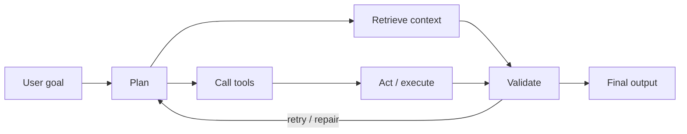

<h1>Hari Kancharla</h1>

<h3>AI Software Engineer building systems where AI actually does the work.</h3>

  
  
  
  

  <code>Agents</code> · <code>RAG</code> · <code>Evals</code> · <code>Tool Calling</code> · <code>FastAPI</code> · <code>Kubernetes</code>

---

## Snapshot

I build AI systems around LLMs, retrieval, agents, tools, and reliability. I care about the engineering around the model: clean APIs, measurable retrieval, eval loops, latency, observability, and recovery from real failure modes.

<table>
  <tr>
    <td width="33%" valign="top">
      <strong>Agentic systems</strong> 
      Tool use, browser automation, stateful planning, fallbacks, and repair loops.
    </td>
    <td width="33%" valign="top">
      <strong>RAG platforms</strong> 
      Ingestion, retrieval quality, citation checks, validation, and traceable answers.
    </td>
    <td width="33%" valign="top">
      <strong>AI infrastructure</strong> 
      APIs, observability, serving performance, deployment, and production reliability.
    </td>
  </tr>
</table>

---

## Selected Systems

<table>
  <tr>
    <td width="50%" valign="top">
      <h3><a href="https://github.com/harihkk/surf-agentic-browser">Surf</a></h3>
      Autonomous browser agent that turns natural-language goals into Playwright actions.  
      <strong>Hard parts:</strong> browser state, tool calls, bad actions, loops, provider fallback.  
      <code>FastAPI</code> <code>Playwright</code> <code>WebSockets</code> <code>Groq</code> <code>Gemini</code> <code>Ollama</code>
    </td>
    <td width="50%" valign="top">
      <h3>AskRC</h3>
      Production-style RAG platform for technical documentation and research workflows.  
      <strong>Hard parts:</strong> ingestion, retrieval quality, citation validation, answer checks.  
      <code>LangChain</code> <code>vector databases</code> <code>MLflow</code> <code>DVC</code> <code>Azure Search</code>
    </td>
  </tr>
  <tr>
    <td width="50%" valign="top">
      <h3>Prompt-Budd</h3>
      Prompt optimization system with scoring, rewriting, PII detection, and MCP support.  
      <strong>Hard parts:</strong> real-time UX, safe rewriting, prompt quality feedback.  
      <code>Chrome Extension</code> <code>FastAPI</code> <code>MCP</code> <code>Gemini</code> <code>OpenAI</code>
    </td>
    <td width="50%" valign="top">
      <h3>GenBI</h3>
      Natural-language BI assistant that turns datasets into charts, tables, and answers.  
      <strong>Hard parts:</strong> routing analytical questions into reliable visual/data outputs.  
      <code>Python</code> <code>FastAPI</code> <code>LangChain</code> <code>Plotly</code> <code>Pandas</code>
    </td>
  </tr>
</table>

---

## System Design Lens

---

## Current Focus

| Area | What I am tuning |
|---|---|
| Browser-agent reliability | Better action selection, state handling, loop prevention, and provider fallback. |
| RAG validation | Retrieval measurement, grounded citations, answer checks, and failure analysis. |
| Agent eval traces | Step-level scoring for tool calls, recoveries, and final-answer quality. |
| Production AI case studies | Systems that are readable, deployable, observable, and honest about tradeoffs. |

---

## Stack

---

## GitHub Signal

 

---

<strong>Building AI systems that do more than demo well.</strong>
 
They retrieve context, call tools, handle failure, validate outputs, and ship.

